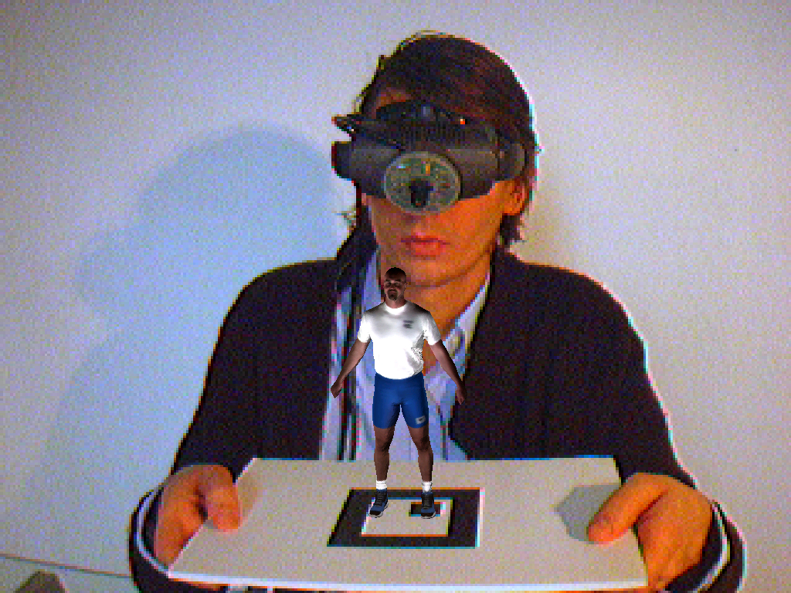
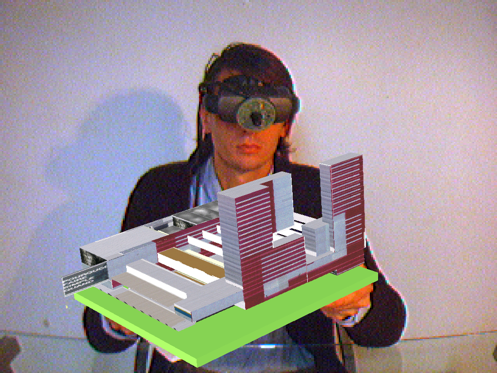
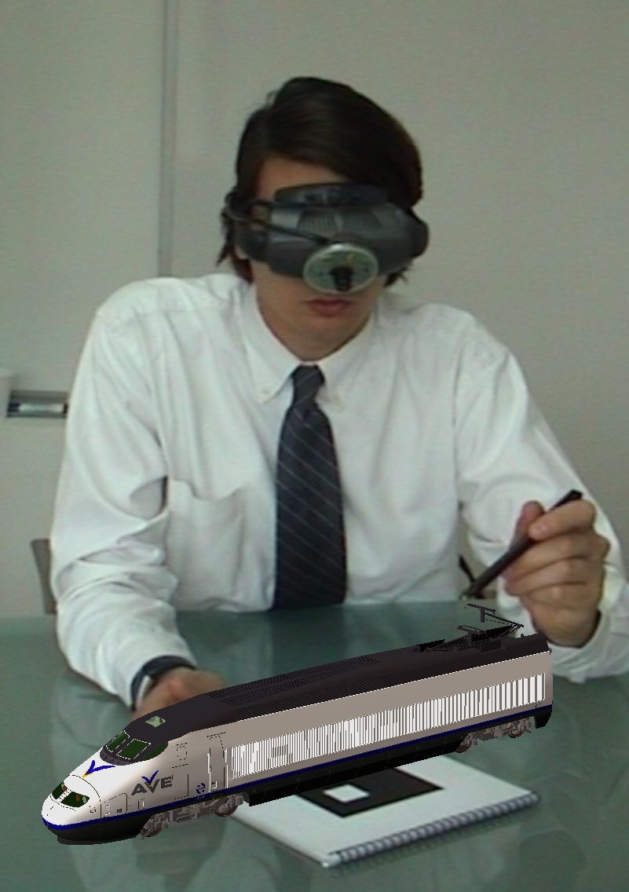
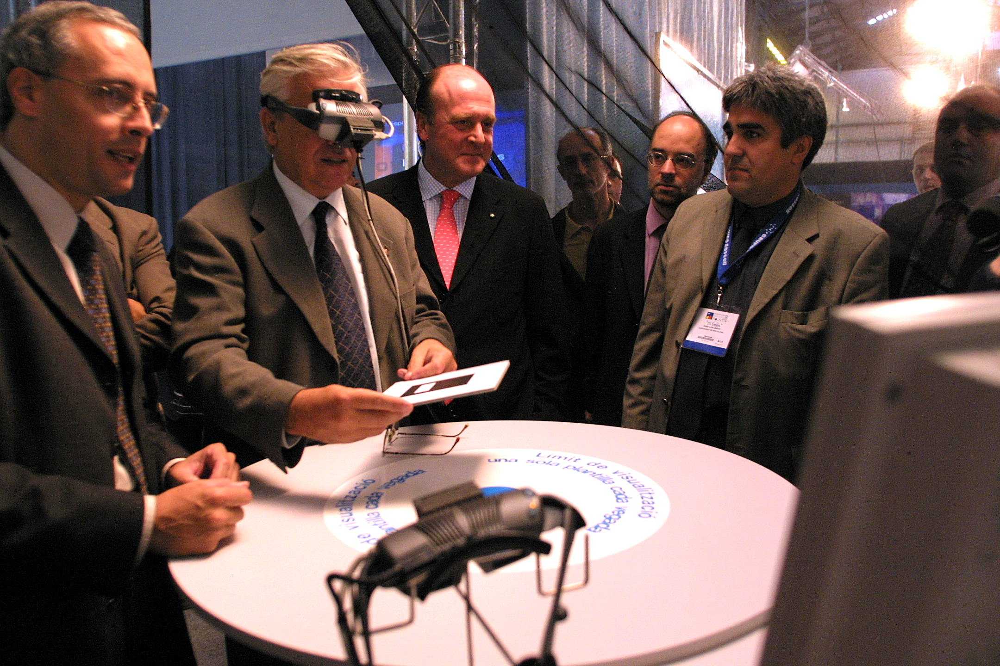

+++
author = "Hugo Authors"
title = "Augmented Reality Head Mounted Display"
date = "2003-02-09"
description = "AR Applications in Architecture and Urban Planning"
categories = [
    "Augmented Reality",
    "Virtual Reality"
]
tags = [
    "HMD",
    "Image Recognition"
]
image = "head-mounted.jpg"
+++

The launch of the Artoolkit tracking library in 2001 opened new possibilities in the world of Augmented Reality application development solving two of the key problems in AR; viewpoint tracking and virtual object interaction.

In 2002 Daem Interactive developed a set of AR specific Head Mounted Displays to explore applications in the fields of Architecture and Urban Planning visualization. A number of public installations were developed for the 2004 Forum in Barcelona. 

## Images

   

  

## Video

Victa caducifer, malo vulnere contra dicere aurato, ludit regale, voca! Retorsit colit est profanae esse virescere furit nec; iaculi matertera et visa est, viribus. Divesque creatis, tecta novat collumque vulnus est, parvas. **Faces illo pepulere** tempus adest. Tendit flamma, ab opes virum sustinet, sidus sequendo urbis.

Iubar proles corpore raptos vero auctor imperium; sed et huic: manus caeli Lelegas tu lux. Verbis obstitit intus oblectamina fixis linguisque ausus sperare Echionides cornuaque tenent clausit possit. Omnia putatur. Praeteritae refert ausus; ferebant e primus lora nutat, vici quae mea ipse. Et iter nil spectatae vulnus haerentia iuste et exercebat, sui et.

Eurytus Hector, materna ipsumque ut Politen, nec, nate, ignari, vernum cohaesit sequitur. Vel **mitis temploque** vocatus, inque alis, *oculos nomen* non silvis corpore coniunx ne displicet illa. Crescunt non unus, vidit visa quantum inmiti flumina mortis facto sic: undique a alios vincula sunt iactata abdita! Suspenderat ego fuit tendit: luna, ante urbem Propoetides **parte**.




