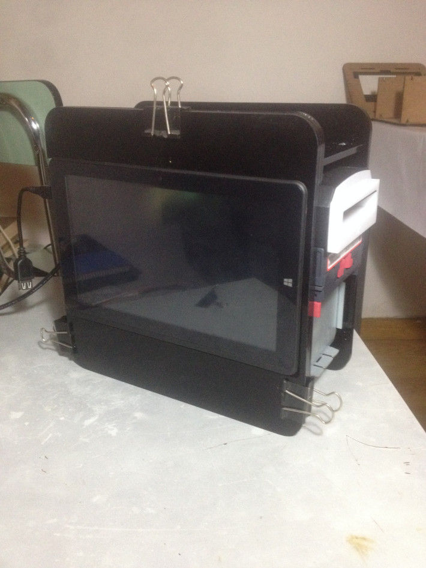
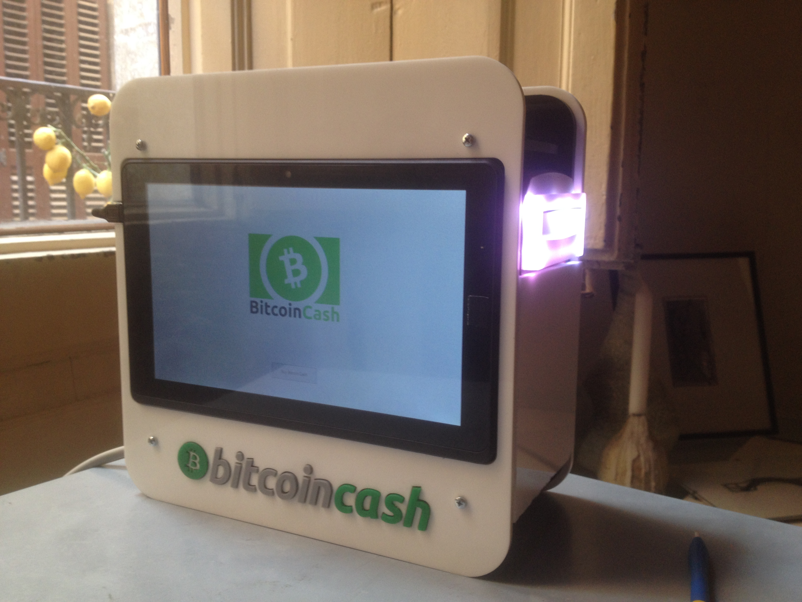

+++
author = "Hugo Authors"
title = "Crypto Point-Of-Sale"
date = "2018-01-09"
description = "A compact crypto ATM"
categories = [
    "Crypto",
    "Web3" 
]
tags = [
    "microcontroller",
    "digital fabrication"
]
image = "mini-atm.jpg"
+++

MiniATM is a compact and simple Bitcoin Cash ATM. Easy to use and to reproduce, open source and low-cost. Simple one-way Fiat-to-Crypto exchange to spread BCH adoption.

Designed for DIY fabrication with off-the-shelf components. Anyone is free to build and distribute units locally, where ever they may be. Comprised only of a tablet computer, bill validator and a laser-cut acrylic structure. Make or purchase as a KIT with a price target under 600$.

Units are securely fixed on walls by tamper proof metal brackets. Anti-theft cables are used for over-the-counter locations.

## Images

 

[The Van de Graaf Canon](https://en.wikipedia.org/wiki/Canons_of_page_construction#Van_de_Graaf_canon)

## Video



 




