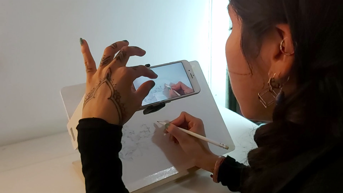
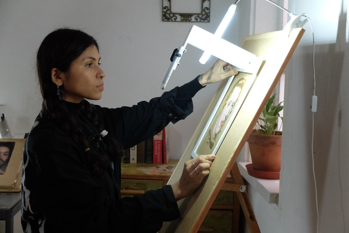
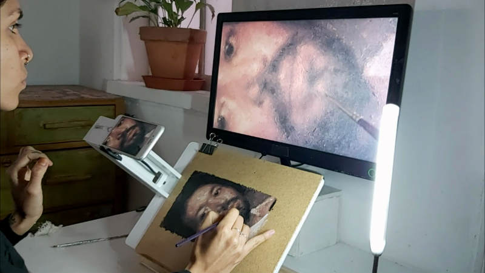

+++
author = "Hugo Authors"
title = "Paint Pad"
date = "2021-01-09"
description = "Learning to paint with Augmented Reality"
categories = [
    "Augmented Reality",
    "Mobile"
]
tags = [
    "Flutter",
    "Digital Fabrication"
]
image = "02.jpg"
+++

**Painting made simple.**

PaintPad is an Aumented Reality easel that turns you phone into a drawing and painting companion. It helps you get shapes, colors and values exactly right every time. It is the ultimate system for any artist, graphic designer or content creator.

**Step by step.**

Select any image and turn it into an easy-to-follow visual guide directly overlayed on your canvas. You'll be amazed at how easy it is, step by step, no matter your age or your experience.

&nbsp;

## Images

    

## Video 



 




