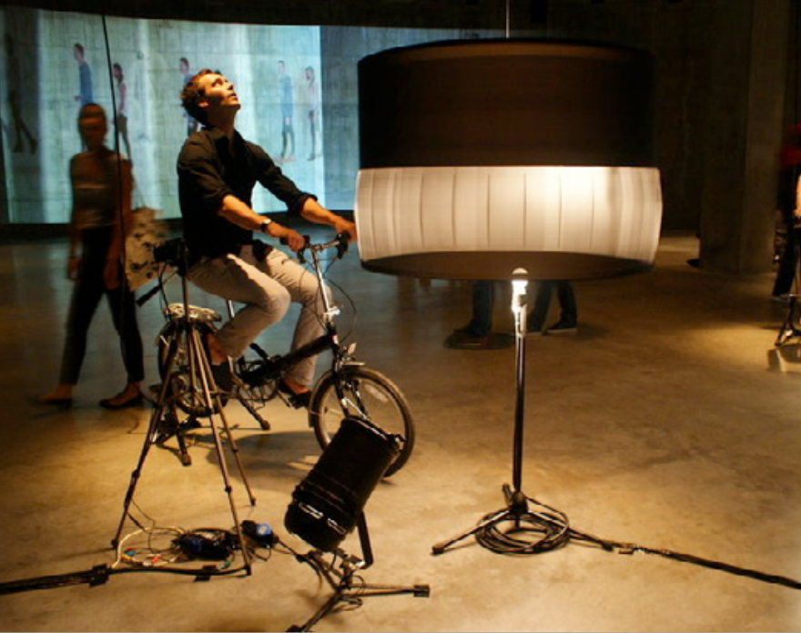

+++
author = "Hugo Authors"
title = "Pedal Power"
date = "2019-02-09"
description = "Pedaling energy for sustainable events"
categories = [
    "Instalation",

]
tags = [
    "Microcontroller",
    "Arduino", 
    "Processing", 
    "Bluetooth"
]
image = "pedal_power.jpg"
+++

Pedal Power is a bicycle installation that allows the transformation of kinetic energy, generated by pedalling, into electrical energy.

This energy, produced by the public in a fun and participatory way, can be used, depending on consumption, to power all kinds of electrical devices and thus give life to endless cultural and commercial events.

## Image Gallery

    

Pedal Power is an ideal tool for outdoor cinema sessions, concerts, performances, DJ sessions, mobile charging stations, brand launches or product presentations where you want to engage the public and convey a message of sustainability, fun and dynamism.

## How does it work
Our bikes are connected to a supercapacitor where the kinetic energy produced by pedaling is stored. In the power station, a power inverter converts the 12 volts DC into 220 volts AC, thus allowing us to power any electrical device. At Pedal Power we do not have batteries nor do we carry any other source of energy other than the one provided by the public.




