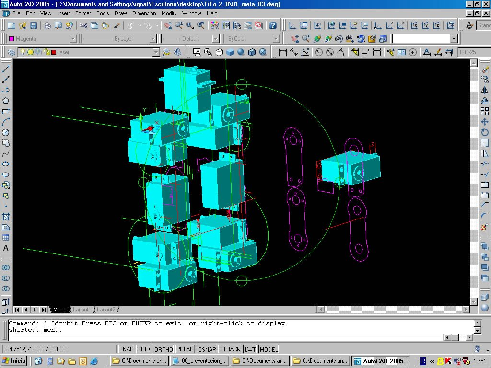
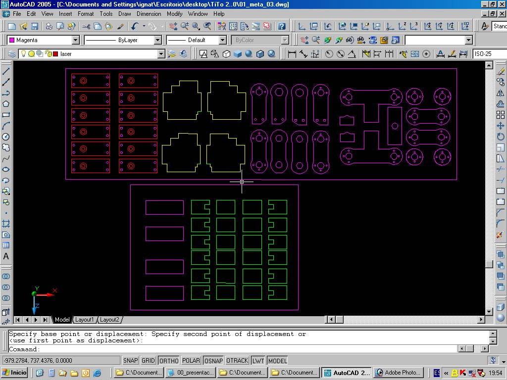
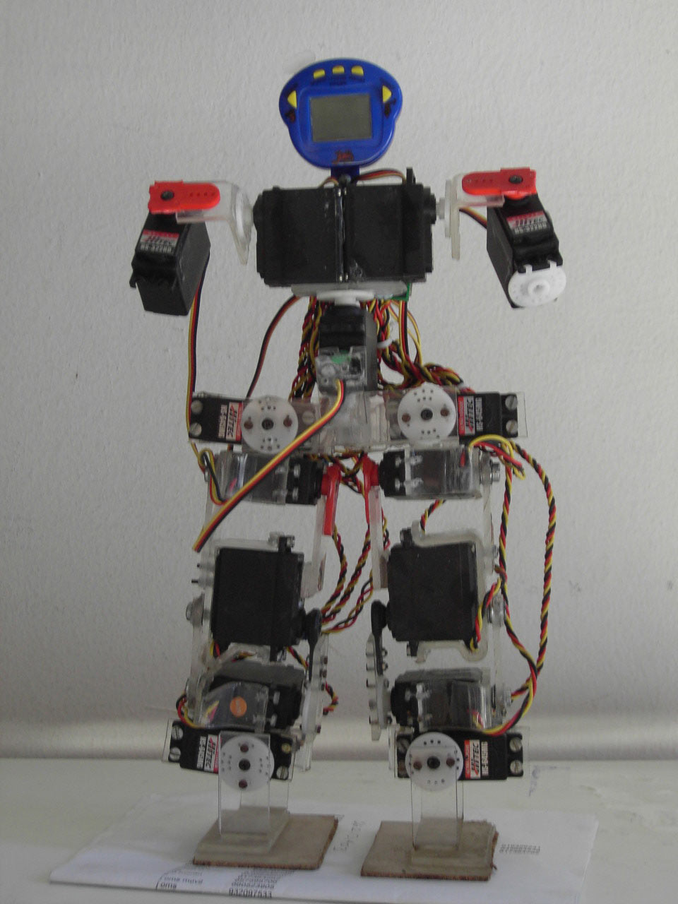
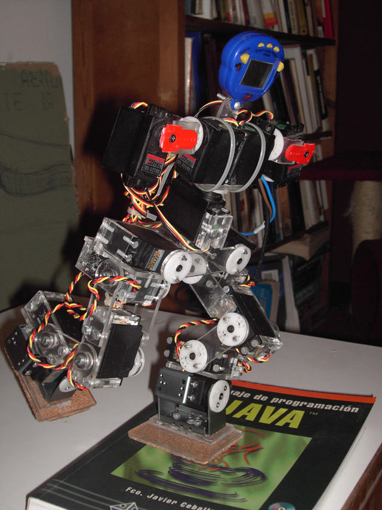

+++
author = "Hugo Authors"
title = "Robo-One"
date = "2004-06-09"
description = "Design and construction of a humanoid robot."
categories = [
    "Robotics",
    "Microcontroller"
]
tags = [
    "fabricación digital", 
    "microcontroller"

    
]
image = "robo-one.jpg"
+++

TiTo is a humanoid robot built with servo-motors and methacrylate. This type of robot is called Robo-One and they are very popular in Japan. It was deliberately built with cheap, accessible and easily manipulated materials. One of the main project objectives was the study of bipedal movement on non-smooth surfaces. 

TiTo was presented at Dorkbot Barcelona and Dorkbot Madrid in 2004.
http://robo-one.blogspot.com/

## Image Gallery

   

  

## Video



 




